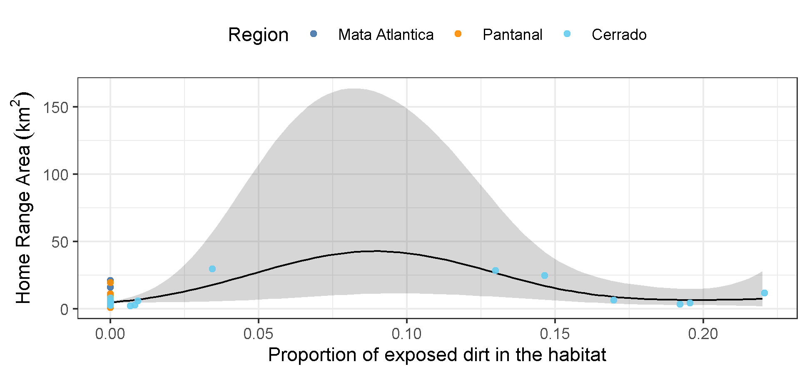

```{r setup, include=FALSE}
knitr::opts_chunk$set(echo = FALSE, eval = TRUE, comment = FALSE)
```

<br />

1 – Lowland Tapir Conservation Initiative (LTCI), Instituto de Pesquisas Ecológicas (IPÊ), Rodovia Dom Pedro I, km 47, 12960-000, Nazaré Paulista, São Paulo, Brazil.

2 – IUCN SSC Tapir Specialist Group (TSG).

3 – Escola Superior de Conservação Ambiental e Sustentabilidade (ESCAS/IPÊ), Rodovia Dom Pedro I, km 47, 12960-000, Nazaré Paulista, São Paulo, Brazil.

4 – The Irving K. Barber Faculty of Science, The University of British Columbia, Okanagan Campus, 1177 Research Road, Kelowna, BC Canada V1V 1V7.

5 – University of Maryland College Park, College Park, MD, USA.

6 – Smithsonian Conservation Biology Institute, Front Royal, VA, USA.

7 – Center for Advanced Systems Understanding (CASUS), Görlitz, Germany.

8 – Helmholtz-Zentrum Dresden Rossendorf (HZDR), Dresden, Germany.

9 – Department of Ecological Modelling, Helmholtz Centre for Environmental Research (UFZ), Leipzig, Germany.


<br />

__\*Corresponding Author__: medici@ipe.org.br

<br />

__Running head:__ Lowland tapir space use


| <!-- -->                  |   | <!-- -->                   |
|---------------------------|---|----------------------------|
|                           |   |                            |
| Words in the abstract: XX |   | Number of Figures: XX      |
|                           |   |                            |
| Words in main text: XX    |   | Number of tables: XX       |
|                           |   |                            |
| Number of references: XX  |   | Supplementary material: XX |

<br />

__Statement on human or animal subjects:__ The Instituto Chico Mendes de Conservação da Biodiversidade (ICMBIO) provided the required annual permits for the capture and immobilization of tapirs and collection of biological samples (SISBIO# 14,603). The Comissão Técnico-Científica (COTEC) do Instituto Florestal do Estado de São Paulo (IF-SP) provided the required permit to carry out research in Morro do Diabo State Park (SMA# 40624/1996). All protocols for the capture, anesthesia, handling and sampling of tapirs have been reviewed and approved by the Veterinary Advisors of the Association of Zoos and Aquariums (AZA) – Tapir Taxon Advisory Group (TAG), and the Veterinary Committee of the IUCN SSC Tapir Specialist Group (TSG). 

# Abstract

__Keywords:__


# Introduction

While agriculture, urbanisation, and transportation infrastructure are critical to human socio-economic improvement [@Esfahani:2003], the associated habitat transformations represent a major threat to species survival [@Fahrig:1997; @Venter:2006gc; @Powers:2019]. Of particular concern is the impact of human activities on animal movement and space use [@Allen:2016; @Tucker:2018jc; @Doherty:2021]. Animal movement governs how individuals, populations, and species interact with each other and the environment [@Schick:2008dn; @Martinez:2020; @He:2021] and mediates key ecological processes [@Bauer:2014]. The capacity for individuals to move unhindered across complex landscapes is therefore critical for species survival and ecosystem function. Problematically, human development has been reducing the amount of habitat available to wildlife [@Brooks:2002; @Cardinale:2012; @Hooper:2012]. This has spurred substantial changes in animal movement behaviour across the globe [@Fahrig:2007fz; @Tucker:2018jc; @Doherty:2021], with potential consequences including reduced fitness and survival, altered predator-prey dynamics, reduced seed dispersal, genetic isolation and local extinction [@Fahrig:2007fz; @Dickie:2017; @Cosgrove:2018; @Tucker:2021].

<!-- The impacts of anthropogenic disturbance are expected to drive individuals to adapt their behaviour to the requirements of human-modified environments [REFS]. -->
Notably, human disturbance has been shown to have differential effects across species [@Toews:2018; @Doherty:2021], even for closely related taxa occupying the same habitat [@Thatte:2020]. Responses to human activities are thus largely taxa and context specific [@Doherty:2021] and there are no clear _a priori_ expectations as to how any given species might be expected to respond to human disturbance. For instance, although @Wall:2021 found a tendency for African elephants (_Loxodonta spp._) to have reduced movement in human modified landscapes,  @Morato:2016ioa noted that jaguars (_Panthera onca_) living in regions with high human population densities occupied home ranges that were orders of magnitude larger than those of jaguars living in more pristine habitats. Consequently, no single conservation strategy can be expected to work in every scenario.

As human disturbance is only expected to worsen over the next decade it is critical to better understand how species respond to human disturbance in order to develop effective, case-specific conservation strategies. To this end, here we focus on understanding how the movement behaviour of lowland tapirs (_Tapirus terrestris_, henceforth 'tapirs') varies across a gradient of human disturbance within three biomes in southern Brazil, the Pantanal, Cerrado, and Atlantic Forest. Lowland tapirs are herbivores of the order Perissodactyla that can reach over 2.5 meters and weigh up to 250kg [@Medici:2011] and are distributed throughout South America [@Gardner:2008]. Tapir populations have suffered severe reductions, with local and regional extirpations, and are currently classified as vulnerable to extinction [@Varela:2019].

Although incorporation information on animal movement is a key component in designing effective wildlife management strategies [@Allen:2016], currently, very little is known about the movement ecology of tapirs [but see @Noss:2003; @Tobler:2008; @pREML]. This knowledge gap is especially pertinent given that large terrestrial mammals - such as tapirs - tend to have larger home ranges and greater absolute mobility than do small mammals [@CalderIII:1983; @Noonan:2020], making them more susceptible to anthropogenic impacts than smaller bodied species [@Tucker:2018jc; @Hill:2020]. Here, we use an extensive telemetry dataset collected over 22 years to describe the movement ecology of tapirs and study how changes in human disturbance influence their movement and space use. Because human activity tends to result in increased movement for large herbivores [@Doherty:2021] our underlying hypothesis was that tapirs should exhibit greater movement distances and larger home range areas when living in human-modified landscapes. Similarly, animals living in highly productive environments do not need to range over wide areas to meet their energetic needs [@Lucherini:1996; @Relyea2000; @Nilsen:2005]. In addition to large home range sizes, tapirs have complex home range structures, with multiple core areas of use [@Tobler:2008] that are established according to the distribution of patches of preferred habitat types. As such, we expect that tapirs should adjust their movement and space use according to local environmental conditions. Findings are directly applicable to developing management plans for tapirs throughout South America.

# Methods

<!-- More details on cleaning, criteria for removal, how many datapoints before and after -->

## Study area and data collection

The data was collected in three different biomes in southern Brazil (Fig. \@ref(fig:map)): Atlantic Forest (1997-2007), Pantanal (2008-2019), and south-western Cerrado (2016-2018).

### Atlantic Forest

Morro do Diabo State Park is a protected area located in the Municipality of Teodoro Sampaio (22°32’S, 52°18’W), state of São Paulo, in the southeastern region of Brazil. The Park has an area of 370 km² composed by a mosaic of mature and secondary deciduous forest, surrounded by the Paranapanema River in the south, and by a matrix of cattle ranches and agriculture, mostly sugar cane, in the remaining borders (Uezu et al. 2008). Its average annual temperature is 22°C; annual rainfall is 1347 mm (Faria and Pires 2006). The Park is part of the “Planalto Forest”, which distinguishes from the coastal forest of the Atlantic Forest biome by having lower annual rainfall and a marked dry season from May to September, more similar to the Cerrado biome (Salis et al. 1995). In fact, the semideciduous forests of the “Planalto Forest” are similar to those occurring within or on the edges of the Cerrado (Salis et al. 1995). 

### Pantanal

Baía das Pedras Ranch, a private property of 145 km², is located in the Nhecolândia Sub-Region of the Southern Pantanal, Municipality of Aquidauana (19°20’S, 55°43’W), Mato Grosso do Sul State, in the central-western region of Brazil. The ranch includes a mosaic of seasonally inundated grasslands, lakes, gallery forests, scrub, and deciduous forests that supports an abundance of wildlife. Cattle are raised extensively over native grasses. The average annual temperature is 25°C; annual rainfall is 1185 mm (Calheiros and Fonseca Júnior 1996). 

### Cerrado

The study site in the Cerrado biome is a mosaic of private properties (cattle ranches and farms) and landless people settlements, 2200 km², within the Municipalities of Nova Alvorada do Sul and Nova Andradina, Mato Grosso do Sul State (21°60’S, 53°83’W). The area includes small fragments of natural Cerrado habitat (Cerradão fragments, gallery forests, and marshland - 25% of the study area), surrounded by areas highly impacted by human activities such as agriculture (particularly sugarcane, soybean and corn), cattle-ranching (cultivated pastureland), Eucalyptus plantations, rural communities, and highways. The average annual temperature is 25°C; annual rainfall is 1185 mm.

In each study site, tapir captures were accomplished by darting after physical restraint in either (i) box traps or (ii) pitfall traps or (iii) by darting from a distance (Quse and Fernandes-Santos 2014). Animals were anesthetized mostly using a combination of butorphanol, medetomidine and ketamine, as described by Medici et al. (2014) and Fernandes-Santos et al. (2020). Reversal agents were administrated at the end of procedures.

The procedures carried out during immobilization included the subcutaneous insertion of a microchip, morphometric measurements, sex and age class determination, physical examination, collection biological samples for health and genetic studies, and placement of a telemetry collar on adults. Animals were tracked using VHF tracking (all three regions; Telonics® MOD500) and GPS tracking (Pantanal and Cerrado; Telonics® TGW SOB and GPS IRIDIUM models). A total of 74 tapirs were tracked starting in July of 1997 until October of 2019, with the majority of the data being in the Pantanal (46), while 17 and 11 were from the Cerrado and Atlantic Forest regions, respectively.

Tapirs equipped with VHF collars were monitored for 5 days per month with data collection concentrated during crepuscular times, 3 hours at dawn (04:00-07:00 h) and 3 hours at dusk (17:00-20:00 h). These periods are the two main peaks of tapir activity [@Medici:2011]. Each tapir was located every 30 minutes during the sampling periods. GPS collars were programmed to obtain a fix every hour. GPS fix success rates were 75% in the Pantanal and 90% in the Cerrado. *Should we mention for how long the animals were monitored?  Average, min and max? *

*Add details on climate and land use?*

```{r map, fig.cap='Location of the tree study sites (Pantanal, Cerrado, Atlantic Forest) over a raster of machine-learning-based human footprint index (ml-HFI), an index of human pressure on the landscape that is derived from remotely sensed surface imagery and ranges on a scale between 0 (no human impact), and 1 (high human impact).', fig.pos='h'}
knitr::include_graphics('../figures/hr-map_inset_dark.png')
```

## Data analysis

All statistical analysis and plotting were performed using `R` [version 4.0.5, @r_core_team_r_2021] using packages `ctmm` [version 0.6.1, @fleming_ctmm_2021], `mgcv` [version 1.8-36, @wood_generalized_2017], `ggplot2` [version 3.3.4, @wickham_ggplot2_2016], `ggmap` [version 3.0.0, @kahle_ggmap_2013]. The `furrr` package [version 0.2.2, @vaughan_furrr_2021] was used for parallel computation on Windows machines. All `R` code can be found in the GitHub repository at https://github.com/StefanoMezzini/tapirs.

### Data calibration and cleaning

Before analysis, we performed an error calibration and data cleaning process in order to minimise the impacts of GPS measurement error and outliers on our subsequent analyses [@fleming_comprehensive_2020]. Data cleaning and calibration were carried out using the methods methods implemented in the `ctmm R` package [@fleming_ctmm_2021]. For this process, location estimates collected via VHF telemetry were assumed to be free from any meaningful measurement error and raw, uncalibrated locations were carried forward in the analyses. Location estimates collected via GPS tracking were calibrated using a unitless Horizontal Dilution of Precision (HDOP), which estimated the accuracy of each positional fix. We then estimated an equivalent range error with the HDOP values from 883 and 174 measurements from tags in fixed locations in the Pantanal and Cerrado, respectively. This allowed for the unite-less HDOP values to be converted into estimates of measurement error in meters. After calibration, data points were considered as outliers (and removed) if they had a large (error-informed) distance from the median location and the minimum speed required to explain the displacement was unusually high ($\ge 1$m/s). The Mata Atlântica dataset contained a total of 4 082 observations, 8 of which were removed as outliers; the Pantanal dataset contained 139 138 observations, 914 of which were removed; while the Cerrado dataset contained 90 402 observations, 193 of which were removed. *(no speed outliers found when I (Stefano) was cleaning the datasets, but 1105 outliers had already been removed)*

### Movement modelling and home range estimation

For each of the monitored tapirs we quantified a number of key movement metrics and home range related characteristics that allowed us to test for an effect of human disturbance on tapir movement behaviour. For this we first identified the best Continuous-Time Movement Model (CTMM) for each animal using the `ctmm.select` function from the `ctmm` package. This fits a series of CTMMs to location data using perturbative Hybrid Residual Maximum Likelihood (pHREML, @fleming_overcoming_2019) and chooses the best model using small-sample-sized corrected Akaike’s Information Criterion (AICc). The models used here are insensitive to sampling frequency (@noonan_scale-insensitive_2019) and they account for spatio-temporal autocorrelation in the data (when necessary), so they are robust to irregular or frequent sampling frequency [@Fleming:2018], HR underestimation [@AKDEvsKDE], and significance inflation [@Fleming:2021]. The parameter estimates from each individual's movement model provided information on the tapir's home range crossing time (in days), and directional persistence timescale (in hours).

We then conditioned off of the selected CTMMs to estimated each animal's 95% home range (HR) area (in km$^2$) using small-sample-size bias corrected Autocorrelated Kernel Density Estimation (AKDE) [@Fleming:2017], and average daily speed (in km/day) using continuous-time speed and distance (CTSD) estimation [@noonan_scale-insensitive_2019].

### Movement pattern analyses

We were first interested in understanding how home-range areas and movement metrics differed across the three biomes, as well as between animals of different age and sex. For these comparisons, home range estimates were compared using the meta-analysis methods implemented in the `ctmm` package [@Fleming:2021], whereas other movement metrics were analysed using the meta-regression model implemented in the `R` package `metafor` [@Viechtbauer:2010], which allowed uncertainty in each individual estimate to be propagated into the population level estimate when making comparisons.

To test whether tapirs responded to different environment types, the HR sizes and average daily speeds were regressed against the proportions of the habitat types in each HR. Similarly, the HR sizes and average daily speeds were regressed against their HR's average machine-learning-based human footprint index (ml-HFI) [@Keys:2021] to test whether environmental modification significantly altered the animals' behavior. The ml-HFI is an index of human pressure on the landscape that is derived from remotely sensed surface imagery and ranges on a scale between 0 (no human impact), and 1 (high human impact). For these models we applied Generalized Additive Models (GAMs) with a Gamma distribution and a log link function for the response. The Gamma distribution allows for more accurate significance testing, while the log link scale allows HFI to have a multiplicative effect on the response. The GAMs were fit using the `mgcv` package [@wood_generalized_2017] and Restricted Maximum Likelihood (REML), and the best model was selected using Akaike’s Information Criterion (AIC).

# Results

There was no significant difference in the home range estimates between individuals who were monitored using GPS collars, VHF tracking, or a mixture of the two (GPS as the control, p-values: 0.495 for GPS and VHF, 0.739 for VHF only, see Fig. \@ref(fig:vhf-hr)).

```{r vhf-hr, fig.cap='Estimated 95% home range area by tracking method. Tapirs were monitored using GPS collars, Very High Frequency (VHF) tracking, or both.', fig.pos='h'}
knitr::include_graphics('../figures/vhf-hr-boxplots.png')
```

## Individual variation in movement and space use

*change values to more appropriate estimates; currently using mean +/- 1.96 sd/sqrt(n)*

```{r speed-regressions, eval=FALSE}
library('dplyr')     # for data wrangling
library('ggplot2')   # for plotting
library('mgcv')      # for fitting GAMs

# color palette
pal <- c('#4477AA', '#ff8c00', '#66CCEE', '#009900',
         '#CCBB44', '#EE6677', '#AA3377', '#BBBBBB')

tapirs <- readRDS('../models/tapirs-final.rds') # tapir data
table(tapirs$age) # categories with 1 individual -> group ages together
table(tapirs$adult)

m.speed.sex <- gam(speed.est ~ sex,
                   family = Gamma('log'),
                   data = tapirs,
                   method = 'REML')
m.speed.age <- gam(speed.est ~ adult,
                   family = Gamma('log'),
                   data = tapirs,
                   method = 'REML')
# model summaries
summary(m.speed.sex)
summary(m.speed.age)

# predictions
tibble(Sex = c('MALE', 'FEMALE'),
       bind_cols(predict(m.speed.sex, tibble(sex = Sex), se.fit = TRUE))) %>%
  mutate(est = round(exp(fit), 2),
         lwr = round(exp(fit - 1.96 * se.fit), 2),
         upr = round(exp(fit + 1.96 * se.fit), 2))
tibble(Adult = c('Yes', 'No'),
       bind_cols(predict(m.speed.age, tibble(adult = Adult), se.fit = TRUE))) %>%
  mutate(est = round(exp(fit), 2),
         lwr = round(exp(fit - 1.96 * se.fit), 2),
         upr = round(exp(fit + 1.96 * se.fit), 2))
```

The mean home range size across all monitored tapirs was 5.82 km$^2$ (95% CI: 4.71 - 7.12), ranging between  1 km$^2$ and 29.7 km$^2$ (Fig. \@ref(fig:meta)a). Tapirs had HR crossing times of 0.72 days on average (95% CI: 0.35 - 1.10), ranging from 0.05 to 12.8 days (Fig. \@ref(fig:meta)b), and a mean velocity autocorrelation timescale of 0.44 hours (95% CI: 0.39 - 0.49), ranging from 0.17 to 1.88 hours (Fig. \@ref(fig:meta)c). We estimated that tapirs had mean movement speeds of 11.2 km/day (95% CI: 10.2 - 12.1), ranging from 1.51 to 25.96 km/day (Fig. \@ref(fig:meta)d). There was no evidence that average daily speed differed between sexes (females: 10.5 km/day, 95% CI: 9.19 - 12.0; males: 11.9 km/day; 95% CI: 10.3 - 13.7, $p = 0.22$, \@ref(fig:boxplots)a), and there was little to no evidence of it differing between age groups (adults: 11.8 km/day, 95% CI: 10.6 - 13.2; sub-adults: 9.52 km/day, 95% CI: 7.94 - 11.4; $p = 0.053$, Fig. \@ref(fig:boxplots)b).

```{r, eval = FALSE, echo = FALSE}
# see maps.R script
select(tap, name, speed.est, speed.high, speed.low, tau.position.est,
       tau.position.low, tau.position.high, tau.velocity.est, tau.velocity.low,
       tau.velocity.high, average) %>%
  filter(average)
range(tapirs$speed.est, na.rm = TRUE) # km/day
```

```{r meta, fig.cap='Parameter estimates from each tapir\'s movement model (circles) and group means (triangles), with 95% confidence intervals. Individuals with a movement model that does not allow for inferences in movement speed are left blank.', fig.pos='h'}
knitr::include_graphics('../figures/meta.png')
```

```{r boxplots, fig.cap='Boxplots of daily average speed (a, b) and estimated home range size (c, d) by sex and age group.'}
knitr::include_graphics('../figures/boxplots.png')
```

```{r hr-area-regressions, eval=FALSE}
m.hr.sex <- gam(area.est ~ sex,
                family = Gamma('log'),
                data = tapirs,
                method = 'REML')
m.hr.age <- gam(area.est ~ adult,
                family = Gamma('log'),
                data = tapirs,
                method = 'REML')
# model summaries
summary(m.hr.sex)
summary(m.hr.age)

# predictions
tibble(Sex = c('MALE', 'FEMALE'),
       bind_cols(predict(m.hr.sex, tibble(sex = Sex), se.fit = TRUE))) %>%
  mutate(est = round(exp(fit), 2),
         lwr = round(exp(fit - 1.96 * se.fit), 2),
         upr = round(exp(fit + 1.96 * se.fit), 2))
tibble(Adult = c('Yes', 'No'),
       bind_cols(predict(m.hr.age, tibble(adult = Adult), se.fit = TRUE))) %>%
  mutate(est = round(exp(fit), 2),
         lwr = round(exp(fit - 1.96 * se.fit), 2),
         upr = round(exp(fit + 1.96 * se.fit), 2))
```

There was no evidence that home ranges sizes differed between sexes (males: 5.43 km$^2$, 95% CI: 3.84 - 7.68; females: 6.27 km$^2$, 95% CI: 4.64 - 8.48; $p = 0.541$, Fig. \@ref(fig:boxplots)c) nor between age groups (adults: 5.47 km$^2$, 95% CI: 4.21 - 7.1; sub-adults: 7.01 km$^2$, 95% CI: 4.63 - 10.6; $p = 0.324$, Fig. \@ref(fig:boxplots)d).

## Variation in movement across biomes and gradients of human disturbance

The Atlantic Forest, Cerrado, and Pantanal varied substantially in habitat composition, levels of human disturbance, and tapir population densities (*NEED TO EXPAND ON THIS AND DECIDE IF THIS KIND OF DESCRIPTION GOES HERE, OR IN EARLIER IN THE INTRO/METHODS*). Despite this, we found that lowland tapir movement behaviour and space use were consistent across all three biomes (Fig. \@ref(fig:meta).

```{r lu-reg, fig.cap='Estimated mean effect of exposed dirt on the tapirs\' estimated home range area.'}


### model summary:
# Family: Gamma 
# Link function: log 
# 
# Formula:
# area.est ~ s(dirt, k = 5)
# 
# Parametric coefficients:
#             Estimate Std. Error t value Pr(>|t|)    
# (Intercept)  1.68094    0.09319   18.04   <2e-16 ***
# ---
# Signif. codes:  0 ‘***’ 0.001 ‘**’ 0.01 ‘*’ 0.05 ‘.’ 0.1 ‘ ’ 1
# 
# Approximate significance of smooth terms:
#           edf Ref.df     F p-value  
# s(dirt) 2.987  3.493 3.495  0.0228 *
# ---
# Signif. codes:  0 ‘***’ 0.001 ‘**’ 0.01 ‘*’ 0.05 ‘.’ 0.1 ‘ ’ 1
# 
# R-sq.(adj) =  0.477   Deviance explained = 28.6%
# -REML = 193.89  Scale est. = 0.64264   n = 74
```

We also found that habitat type had little effect on HR area or average animal speed (Fig. lu-reg). The best HR area model only accounted for the effect of areas of exposed dirt (approximate p-value: 0.023, $R^2_{adj}$ = 0.477), while no land use types had a significant effect on an animal's average speed. There was very little difference between the AIC of the full model (312.51, df = 11.41, 8 predictors) and that of the model with not predictors but the intercept term (310.89, df = 2). *should we add an analysis of the starting point of each segment and its speed, so we can account for how quickly an animal would leave a given habitat type? Using only the averages likely decreases significance and hides trends. -- Stefano*

HFI had no significant effect on either lowland tapir home range size (p-value = 0.90; Fig. \@ref(fig:hfi-reg)a), nor average daily movement speed (p-value = 0.53; Fig. \@ref(fig:hfi-reg)b). A tapir living in a near pristine environment (HFI = 0.004) was estimated to have a home range of 7.77 km$^2$ (95% CI: 2.12 - 28.6) and an average speed of 13.19 km/day (95% CI: 7.82 - 22.1), while a tapir from the most altered habitat we monitored (HFI = 0.31) had an estimated home range area of 6.93 km$^2$ (95% CI: 3.36 - 14.3) and an average speed of 10.43 km/day (95% CI: 8.27 - 13.2).

```{r hfi-reg, fig.cap='Estimated mean effect of machine-learning-based human footprint index (ml-HFI) on the tapirs\' estimated home range area and estimated average daily speed.'}
knitr::include_graphics('../figures/hfi-regressions.png')
```

```{r, eval = FALSE, echo = FALSE}
# see hfi-regressions.R
MIN <- min(tapirs$hfi.mean) %>% round(3)
MAX <- max(tapirs$hfi.mean) %>% round(3)
# estimates
tibble(hfi.mean = c(MIN, MAX),
       bind_cols(predict(m0, newdata = tibble(hfi.mean), se.fit = TRUE),
                 predict(m3, newdata = tibble(hfi.mean), se.fit = TRUE))) %>%
  transmute(hfi.mean,
            est.hr = exp(fit...1),
            low.hr = exp(fit...1 - 1.96 * se.fit...2),
            high.hr = exp(fit...1 + 1.96 * se.fit...2),
            est.speed = exp(fit...3),
            low.speed = exp(fit...3 - 1.96 * se.fit...4),
            high.speed = exp(fit...3 + 1.96 * se.fit...4))

summary(m0)
summary(m3)
```

***ADD AKDE RESULTS?*** (Fig. \@ref(fig:akdes))

```{r akdes, fig.cap='Autocorrelated kernel density estimations of each tapir\'s 95% home range.'}
knitr::include_graphics('../figures/hr-map.png')
```

# Discussion

<!-- As genotypic adaptation takes generations to occur [@Barnosky:2007ek], behavioral plasticity provides the most immediate response to human activities [@Sih:2011]. The capacity for behavioural plasticity in response to human disturbance is especially important for long-lived, K-selected species [@Rosenheim:1991; @Sih:2011; @Montgomery:2020] that take longer to reach sexual maturity, and have longer inter-generational times than short-lived species [@deMagalhaes:2009]. -->


# Acknowledgments

The study of tapir movement ecology has been an important component of the long-term activities of the Lowland Tapir Conservation Initiative (LTCI) – Instituto de Pesquisas Ecológicas (IPÊ) in Brazil. The LTCI has the institutional support from the International Union for Conservation of Nature (IUCN) Species Survival Commission (SSC) Tapir Specialist Group (TSG), Association of Zoos and Aquariums (AZA) Tapir Taxon Advisory Group (TAG), and European Association of Zoos and Aquariums (EAZA) Tapir Taxon Advisory Group (TAG). LTCI's financial support comes from national and international agencies, including zoological institutions, foundations, private businesses, and private individuals. MJN was supported by an NSERC Discovery Grant RGPIN-2021-02758. This work was partially funded by the Center of Advanced Systems Understanding (CASUS) which is financed by Germany's Federal Ministry of Education and Research (BMBF) and by the Saxon Ministry for Science, Culture and Tourism (SMWK) with tax funds on the basis of the budget approved by the Saxon State Parliament. CHF, and JMC were supported by NSF IIBR 1915347. EPM would like to thank the Smithsonian Conservation Biology Institute (SCBI) for hosting her for a 2-month research visit for initial data processing and analysis. 

# References
