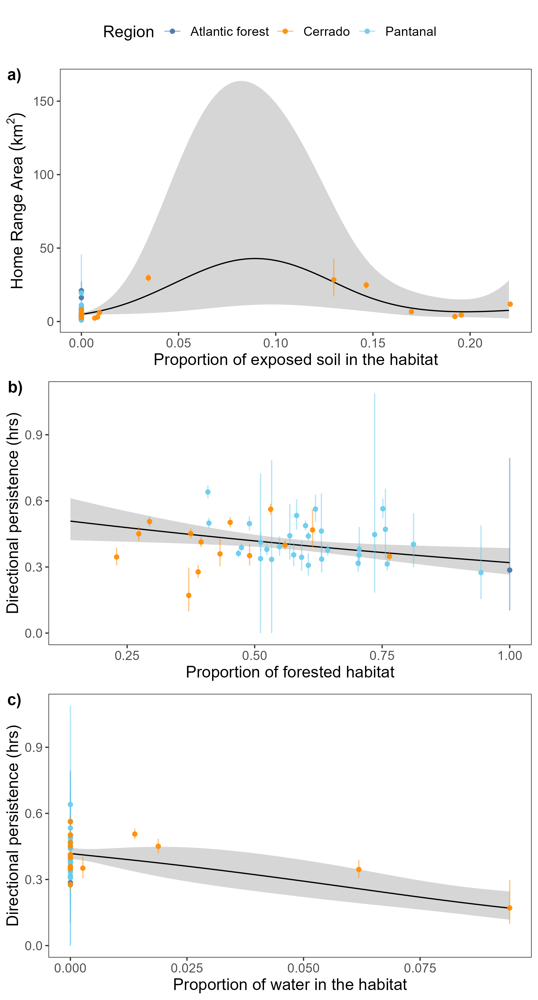

```{r setup, include=FALSE}
knitr::opts_chunk$set(echo = FALSE, eval = TRUE, comment = FALSE)
```

<br />

1 – Lowland Tapir Conservation Initiative (LTCI), Instituto de Pesquisas Ecológicas (IPÊ), Rodovia Dom Pedro I, km 47, 12960-000, Nazaré Paulista, São Paulo, Brazil.

2 – IUCN SSC Tapir Specialist Group (TSG).

3 – Escola Superior de Conservação Ambiental e Sustentabilidade (ESCAS/IPÊ), Rodovia Dom Pedro I, km 47, 12960-000, Nazaré Paulista, São Paulo, Brazil.

4 – The Irving K. Barber Faculty of Science, The University of British Columbia, Okanagan Campus.

5 – University of Maryland College Park, College Park, MD, USA.

6 – Smithsonian Conservation Biology Institute, Front Royal, VA, USA.

7 – Center for Advanced Systems Understanding (CASUS), Görlitz, Germany.

8 – Helmholtz-Zentrum Dresden Rossendorf (HZDR), Dresden, Germany.

9 – Department of Ecological Modelling, Helmholtz Centre for Environmental Research (UFZ), Leipzig, Germany.

<br />

__\*Corresponding Author__: medici@ipe.org.br

<br />

__Running head:__ Lowland tapir space use


| <!-- -->                  |   | <!-- -->                   |
|---------------------------|---|----------------------------|
|                           |   |                            |
| Words in the abstract: XX |   | Number of Figures: XX      |
|                           |   |                            |
| Words in main text: XX    |   | Number of tables: XX       |
|                           |   |                            |
| Number of references: XX  |   | Supplementary material: XX |

<br />

__Statement on human or animal subjects:__ The Instituto Chico Mendes de Conservação da Biodiversidade (ICMBIO) provided the required annual permits for the capture and immobilization of tapirs and collection of biological samples (SISBIO# 14,603). The Comissão Técnico-Científica (COTEC) do Instituto Florestal do Estado de São Paulo (IF-SP) provided the required permit to carry out research in Morro do Diabo State Park (SMA# 40624/1996). All protocols for the capture, anesthesia, handling and sampling of tapirs have been reviewed and approved by the Veterinary Advisors of the Association of Zoos and Aquariums (AZA) – Tapir Taxon Advisory Group (TAG), and the Veterinary Committee of the IUCN SSC Tapir Specialist Group (TSG). 

# To Do List: {-}

* Create a csv file with summary stats for each animal (ID, sampling duration, sampling interval, sampling type, biome, HR size, habitat proportions, HFI, etc.) to be included as supplementary material.

# Abstract {-}

__Keywords:__ Anthropogenic impacts, GPS tracking, Home range, Human Footprint Index, Space use


# Introduction {-}

While agriculture, urbanisation, and transportation infrastructure are critical to human socio-economic improvement [@Esfahani:2003], the associated habitat transformations represent a major threat to species survival [@Fahrig:1997; @Venter:2006gc; @Powers:2019]. Of particular concern is the impact of human activities on animal movement and space use [@Allen:2016; @Tucker:2018jc; @Doherty:2021]. Animal movement governs how individuals, populations, and species interact with each other and the environment [@Schick:2008dn; @Martinez:2020; @He:2021] and mediates key ecological processes [@Bauer:2014]. The capacity for individuals to move unhindered across complex landscapes is therefore critical for species survival and ecosystem function. Problematically, human development has been reducing the amount of habitat available to wildlife [@Brooks:2002; @Cardinale:2012; @Hooper:2012]. This has spurred substantial changes in animal movement behaviour across the globe [@Fahrig:2007fz; @Tucker:2018jc; @Doherty:2021], with potential consequences including reduced fitness and survival, altered predator-prey dynamics, reduced seed dispersal, genetic isolation and local extinction [@Fahrig:2007fz; @Dickie:2017; @Cosgrove:2018; @Tucker:2021].

Notably, human disturbance has been shown to have differential effects across species [@Toews:2018; @Doherty:2021], even for closely related taxa occupying the same habitat [@Thatte:2020]. Responses to human activities are thus largely taxa and context specific [@Doherty:2021] and can not be expected to be consistent across taxa. For instance, while @Wall:2021 found a tendency for African elephants (_Loxodonta spp._) to exhibit reduced movement in human modified landscapes, @Morato:2016ioa noted that jaguars (_Panthera onca_) living in regions with high human population densities in South America occupied home ranges that were orders of magnitude larger than those of jaguars living in more pristine habitats. As human disturbance is only expected to worsen over the next decade it is critical to better understand how species respond to human disturbance in order to develop effective, case-specific conservation strategies.

Here we focus on understanding how the movement behaviour of lowland tapirs (_Tapirus terrestris_, henceforth 'tapirs') varies across a gradient of human disturbance within three biomes in southern Brazil, the Pantanal, Cerrado, and Atlantic Forest. Lowland tapirs are herbivores of the order Perissodactyla that can reach over 2.5 meters and weigh up to 250kg [@Medici:2011]. While tapirs are distributed throughout South America [@Gardner:2008], their populations have suffered severe reductions, with local and regional extirpations, and are currently classified as vulnerable to extinction [@Varela:2019]. Although the incorporation information on animal movement is a key component in designing effective conservation and recovery strategies [@Allen:2016], currently, very little is known about the movement ecology of tapirs [but see @Noss:2003; @Tobler:2008; @pREML]. This knowledge gap is especially pertinent given that large terrestrial mammals - such as tapirs - tend to have larger home ranges and greater absolute mobility than do small mammals [@CalderIII:1983; @Noonan:2020], making them more susceptible to anthropogenic impacts than smaller bodied species [@Tucker:2018jc; @Hill:2020]. Here, we use an extensive telemetry dataset collected over 22 years to describe the movement ecology of tapirs and study how changes in human disturbance influence their movement and space use. Because human activity tends to result in increased movement for large herbivores [@Doherty:2021] our underlying hypothesis was that tapirs should exhibit greater movement distances and larger home range areas when living in human-modified landscapes. Further, animals living in highly productive environments do not need to range over wide areas to meet their energetic needs [@Lucherini:1996; @Relyea2000; @Nilsen:2005]. As such, we expect that tapirs should adjust their movement and space use according to local environmental conditions.

# Methods {-}

<!-- More details on cleaning, criteria for removal, how many datapoints before and after -->

## Study area and data collection  {-}

The data was collected in three different biomes in southern Brazil (Fig. \@ref(fig:map)): Atlantic Forest (1997-2007), Pantanal (2008-2019), and south-western Cerrado (2016-2018).

### Atlantic Forest {-}

Morro do Diabo State Park is a protected area located in the Municipality of Teodoro Sampaio (22°32’S, 52°18’W), state of São Paulo, in the southeastern region of Brazil. The Park has an area of 370 km² composed by a mosaic of mature and secondary deciduous forest, surrounded by the Paranapanema River in the south, and by a matrix of cattle ranches and agriculture, mostly sugar cane, in the remaining borders [@Uezu:2008]. Its average annual temperature is 22°C and annual rainfall is 1347 mm (Faria and Pires 2006). The Park is part of the “Planalto Forest”, which is distinguished from the coastal forest of the Atlantic Forest biome by having lower annual rainfall and a marked dry season from May to September, and is thus more similar to the Cerrado biome [@Salis:1995]. In fact, the semi-deciduous forests of the “Planalto Forest” are similar to those occurring within or on the edges of the Cerrado [@Salis:1995]. 

### Pantanal {-}

Baía das Pedras Ranch, a private property of 145 km², is located in the Nhecolândia Sub-Region of the Southern Pantanal, Municipality of Aquidauana (19°20’S, 55°43’W), Mato Grosso do Sul State, in the central-western region of Brazil. The ranch includes a mosaic of seasonally inundated grasslands, lakes, gallery forests, scrub, and deciduous forests that supports an abundance of wildlife and is situated far away from the edges of the biome where deforestation and other anthropogenic threats are occurring. Cattle are raised extensively over native grasses. The average annual temperature is 25°C and annual rainfall is 1185 mm [@Calheiros:1996]. 

### Cerrado {-}

The study site in the Cerrado biome is a 2200 km² mosaic of private properties (cattle ranches and farms) and landless people settlements within the Municipalities of Nova Alvorada do Sul and Nova Andradina, Mato Grosso do Sul State (21°60’S, 53°83’W). The area includes small fragments of natural Cerrado habitat (Cerradão fragments, gallery forests, and marshland - 25% of the study area), surrounded by areas highly impacted by human activities such as agriculture (particularly sugarcane, soybean and corn), cattle-ranching (cultivated pastureland), Eucalyptus plantations, rural communities, and highways. The average annual temperature is 25°C and annual rainfall is 1185 mm.

In each study site, tapir were captured by darting after physical restraint in either box traps or pitfall traps, or by darting from a distance [@Quse:2014]. Animals were anesthetized mostly using a combination of butorphanol, medetomidine and ketamine, as described by @Medici:2014 and @Fernandes:2020. Reversal agents were administrated at the end of procedures. The procedures carried out during immobilization included the subcutaneous insertion of a microchip, morphometric measurements, sex and age class determination, physical examination, collection biological samples for health and genetic studies, and placement of a telemetry collar on adults. Animals were tracked using VHF tracking (all three regions; Telonics® MOD500) and GPS tracking (Pantanal and Cerrado; Telonics® TGW SOB and GPS IRIDIUM models). A total of 74 tapirs were tracked starting in July of 1997 until October of 2019, with the majority of the individuals being in the Pantanal (46), while 17 and 11 were from the Cerrado and Atlantic Forest regions, respectively.

Tapirs equipped with VHF collars were monitored for 5 days per month with data collection concentrated during crepuscular times, 3 hours at dawn (04:00-07:00 h) and 3 hours at dusk (17:00-20:00 h). These periods are the two main peaks of tapir activity [@Medici:2011]. Each tapir was located every 30 minutes during the sampling periods. GPS collars were programmed to obtain a fix every hour and operated for a median of XXX months across all tagged tapirs. GPS fix success rates were 75% in the Pantanal and 90% in the Cerrado. The full dataset comprised 232,622 location estimates collected over a period of 22 years (for full details see Supplementary File S1). In addition to the tapir location data, we collected 883 and 174 measurements from tags in fixed locations in the Pantanal and Cerrado, respectively in order to calibrate the measurement error of the GPS tracking collars.

```{r map, fig.cap='Location of the tree study sites (Pantanal, Cerrado, Atlantic Forest) over a raster of machine-learning-based human footprint index (ml-HFI), an index of human pressure on the landscape that is derived from remotely sensed surface imagery and ranges on a scale between 0 (no human impact), and 1 (high human impact).', fig.pos='h'}
knitr::include_graphics('../figures/hr-map_inset_dark_NEW.png')
```

## Data analysis {-}

Initial exploratory analyses were carried out in `ctmmweb` [version 0.2.11, @Calabrese:2021]. All statistical analysis and plotting were performed using `R` [version 4.0.5, @r_core_team_r_2021] using packages `ctmm` [version 0.6.1, @Calabrese:2016, @fleming_ctmm_2021], `mgcv` [version 1.8-36, @wood_generalized_2017], `ggplot2` [version 3.3.4, @wickham_ggplot2_2016], `ggmap` [version 3.0.0, @kahle_ggmap_2013]. The `furrr` package [version 0.2.2, @vaughan_furrr_2021] was used for parallel computation on Windows machines. All `R` code can be found in the GitHub repository at https://github.com/StefanoMezzini/tapirs.

### Data calibration and cleaning {-}

Before analysis, we performed an error calibration and data cleaning process in order to minimise the impacts of GPS measurement error and outliers on our subsequent analyses [@fleming_comprehensive_2020]. Data cleaning and calibration were carried out using the methods methods implemented in the `ctmm R` package [@fleming_ctmm_2021]. For this process, location estimates collected via VHF telemetry were assumed to be free from any meaningful measurement error and raw locations were carried forward in the analyses. Measurement error on the GPS data was calibrated using a unitless Horizontal Dilution of Precision (HDOP), which quantifies the accuracy of each positional fix. We then estimated an equivalent range error with the HDOP values from the tags in fixed locations. This allowed for the unitless HDOP values to be converted into estimates of measurement error in meters. After calibration, data points were considered as outliers (and removed) if they had a large (error-informed) distance from the median location and the minimum speed required to explain the displacement was unusually high ($\ge 1$m/s). The Atlantic Forest dataset contained a total of 4,082 observations, 8 of which were removed as outliers; the Pantanal dataset contained 139,138 observations, 914 of which were removed; while the Cerrado dataset contained 90,402 observations, 193 of which were removed.

### Movement modelling and home range estimation {-}

For each of the monitored tapirs we quantified a number of key movement metrics and home range-related characteristics that allowed us to test for an effect of human disturbance on tapir movement behaviour. For this we first identified the best Continuous-Time Movement Model (CTMM) for each animal using the `ctmm.select` function from the `ctmm` package. This fits a series of CTMMs to location data using perturbative Hybrid Residual Maximum Likelihood (pHREML, @fleming_overcoming_2019) and chooses the best model using small-sample-sized corrected Akaike’s Information Criterion (AICc). The models used here are insensitive to sampling frequency (Johnson:2008eq, @Fleming:2014, @Blackwell:2016dw) and they account for spatio-temporal autocorrelation in the data (when necessary), so they are robust to irregular or frequent sampling frequency [@Fleming:2018]. The parameter estimates from each individual's movement model provided information on the tapir's home range crossing time ($\tau_p$, in days), and directional persistence timescale ($\tau_v$, in hours).

We then conditioned on the selected CTMMs to estimated each animal's 95% home range (HR) area (in km$^2$) using small-sample-size bias corrected Autocorrelated Kernel Density Estimation (AKDE) [@Fleming:2017], and average daily speed (in km/day) using continuous-time speed and distance (CTSD) estimation [@noonan_scale-insensitive_2019].

### Movement pattern analyses {-}

We were first interested in understanding how home-range areas and movement metrics differed across the three biomes, as well as between animals of different age and sex. For these comparisons, home range estimates were compared using the meta-analysis methods implemented in the `ctmm` package [@Fleming:2021], whereas other movement metrics were analysed using the meta-regression model implemented in the `R` package `metafor` [@Viechtbauer:2010], which allowed uncertainty in each individual estimate to be propagated into the population level estimate when making comparisons.

To test whether tapirs responded to different environment types, the HR sizes and average daily speeds were regressed against the proportions of the habitat types in each HR. For the Atlantic Forest, we used the habitat map provided in the park’s management plan [@Faria:2006]. For the Pantanal and Cerrado, we obtained satellite imagery from the periods of data collection. Habitat classification was then carried out using GIS software, and a team of researchers confirmed the classifications in the field. Similarly, the HR sizes and average daily speeds were regressed against their HR's average machine-learning-based human footprint index (ml-HFI) [@Keys:2021] to test whether environmental modification significantly altered the animals' behavior. The ml-HFI is an index of human pressure on the landscape that is derived from remotely sensed surface imagery and ranges on a scale between 0 (no human impact), and 1 (high human impact). For these models we applied Generalized Additive Models (GAMs) with a Gamma distribution and a log link function for the response. The Gamma distribution allows for more accurate significance testing and is an appropriate distribution for variables that range between 0 and $\infty$, while the log link scale allows HFI to have a multiplicative effect on the response. The GAMs were fit using the `mgcv` package [@wood_generalized_2017] and Restricted Maximum Likelihood (REML), and the best model was selected using AIC.

# Results {-}

## Individual variation in movement and space use {-}

```{r speed-regressions, eval=FALSE}
library('dplyr')     # for data wrangling
library('purrr')     # for functional programming
library('mgcv')      # for fitting GAMs
library('ctmm')      # for animal movement stuff
library('metafor')   # for meta-analysis
N <- 74 # number of tapirs

tapirs <- readRDS('../models/tapirs-final.rds') # tapir data

# categories with 1 individual -> group ages together
table(tapirs$age)
table(tapirs$adult)

# HR
meta(tapirs$model, plot = FALSE) %>% round(2)
# to extract SDs: ctmm:::area.covm(tapirs$model[[1]]$sigma)
# to extract DFs: map_dbl(tapirs$model, ctmm:::DOF.area)

d.hr <-
  escalc(measure = 'MN', # regression on the (untransformed) mean
         mi = area.est, # estimates
         sdi = map_dbl(1:N, # standard deviations
                       function(i)
                         ctmm:::area.covm(tapirs$model[[i]]$sigma)) %>% sqrt(),
         ni = map_dbl(tapirs$model, ctmm:::DOF.area),
         data = tapirs)

summary(rma(yi ~ 1, vi, data = d.hr, method = 'REML'))


# tau_p
d.tp <-
  escalc(measure = 'MN', # regression on the (untransformed) mean
         mi = tau.position.est, # estimates
         sdi = map_dbl(1:N, # standard deviations
                       function(i)
                         diag(tapirs$model[[i]]$COV)['tau position']) %>% sqrt(),
         ni = map_dbl(tapirs$model, ctmm:::DOF.area),
         data = tapirs)

# may not be able to obtain stable results #####################################
summary(rma(yi ~ region, vi, data = d.tp, method = 'REML'))
summary(rma(yi ~ sex, vi, data = d.tp, method = 'REML'))
summary(rma(yi ~ adult, vi, data = d.tp, method = 'REML'))

# tau_v
d.tp <-
  escalc(measure = 'MN',
         mi = tau.velocity.est,
         sdi = map_dbl(1:N,
                       function(i)
                         speed(tapirs$model[[i]]$COV)['tau velocity']) %>%
           sqrt(),
         ni = map_dbl(1:N,
                      function(i)
                        summary(tapirs$model[[i]])$DOF['speed'],
         data = tapirs)

summary(rma(yi ~ 1, vi, data = d.tv, method = 'REML'))

# speed
d.speed <-
  escalc(measure = 'MN',
         mi = speed.est,
         sdi = map_dbl(1:N,
                       function(i) i) %>% sqrt(),
         ni = map_dbl(1:N,
                      function(i)
                        summary(tapirs$model[[i]])$DOF['speed'],
         data = tapirs)

summary(rma(yi ~ 1, vi, data = d.tv, method = 'REML'))
summary(rma(yi ~ adult, vi, data = d.tv, method = 'REML'))
summary(rma(yi ~ sex, vi, data = d.tv, method = 'REML'))

# same tests with mgcv::gam ####################################################
m.speed.sex <- gam(speed.est ~ sex,
                   family = Gamma('log'),
                   data = tapirs,
                   method = 'REML')
m.speed.age <- gam(speed.est ~ adult,
                   family = Gamma('log'),
                   data = tapirs,
                   method = 'REML')
# model summaries
summary(m.speed.sex)
summary(m.speed.age)

# predictions
tibble(Sex = c('MALE', 'FEMALE'),
       bind_cols(predict(m.speed.sex, tibble(sex = Sex), se.fit = TRUE))) %>%
  mutate(est = round(exp(fit), 2),
         lwr = round(exp(fit - 1.96 * se.fit), 2),
         upr = round(exp(fit + 1.96 * se.fit), 2))
tibble(Adult = c('Yes', 'No'),
       bind_cols(predict(m.speed.age, tibble(adult = Adult), se.fit = TRUE))) %>%
  mutate(est = round(exp(fit), 2),
         lwr = round(exp(fit - 1.96 * se.fit), 2),
         upr = round(exp(fit + 1.96 * se.fit), 2))
```

The mean home range size across all monitored tapirs was 8.31 km$^2$ (95% CI: 6.53 - 10.42; Fig. \@ref(fig:akdes)), ranging between 1 km$^2$ and 29.7 km$^2$ (Fig. \@ref(fig:meta)a). Tapirs had HR crossing times of 0.72 days on average (95% CI: 0.35 - 1.10), ranging from 0.05 to 12.8 days (Fig. \@ref(fig:meta)b), and a mean velocity autocorrelation timescale of 0.44 hours (95% CI: 0.39 - 0.49), ranging from 0.17 to 1.88 hours (Fig. \@ref(fig:meta)c). We estimated that tapirs had mean movement speeds of 11.2 km/day (95% CI: 10.2 - 12.1), ranging from 1.51 to 25.96 km/day (Fig. \@ref(fig:meta)d). There was no evidence that average daily speed differed between sexes (females: 10.5 km/day, 95% CI: 9.19 - 12.0; males: 11.9 km/day; 95% CI: 10.3 - 13.7, $p = 0.22$, \@ref(fig:boxplots)a), nor between age groups (adults: 11.8 km/day, 95% CI: 10.6 - 13.2; sub-adults: 9.52 km/day, 95% CI: 7.94 - 11.4; $p = 0.053$, Fig. \@ref(fig:boxplots)b).

```{r akdes, fig.cap='Autocorrelated kernel density estimations of each tapir\'s 95% home range.'}
knitr::include_graphics('../figures/hr-map.png')
```


```{r, eval = FALSE, echo = FALSE}
# see maps.R script
select(tap, name, speed.est, speed.high, speed.low, tau.position.est,
       tau.position.low, tau.position.high, tau.velocity.est, tau.velocity.low,
       tau.velocity.high, average) %>%
  filter(average)
range(tapirs$speed.est, na.rm = TRUE) # km/day
```

```{r meta, fig.cap='Parameter estimates from each tapir\'s movement model (circles) and group means (triangles), with 95% confidence intervals. Individuals with a movement model that does not allow for inferences in movement speed are left blank.', fig.pos='h'}
knitr::include_graphics('../figures/meta.png')
```

```{r boxplots, fig.cap='Boxplots of daily average speed (a, b) and estimated home range size (c, d) by sex and age group. We note that in the Antlantic Forest it was only possible to estimate movement speeds for a single adult female. In addition, we could only estimate speed for a single young tapir in the Cerrado.'}
knitr::include_graphics('../figures/boxplots.png')
```

```{r hr-area-regressions, eval=FALSE}
m.hr.sex <- gam(area.est ~ sex,
                family = Gamma('log'),
                data = tapirs,
                method = 'REML')
m.hr.age <- gam(area.est ~ adult,
                family = Gamma('log'),
                data = tapirs,
                method = 'REML')
# model summaries
summary(m.hr.sex)
summary(m.hr.age)

# predictions
tibble(Sex = c('MALE', 'FEMALE'),
       bind_cols(predict(m.hr.sex, tibble(sex = Sex), se.fit = TRUE))) %>%
  mutate(est = round(exp(fit), 2),
         lwr = round(exp(fit - 1.96 * se.fit), 2),
         upr = round(exp(fit + 1.96 * se.fit), 2))
tibble(Adult = c('Yes', 'No'),
       bind_cols(predict(m.hr.age, tibble(adult = Adult), se.fit = TRUE))) %>%
  mutate(est = round(exp(fit), 2),
         lwr = round(exp(fit - 1.96 * se.fit), 2),
         upr = round(exp(fit + 1.96 * se.fit), 2))
```

There was no evidence that home ranges sizes differed between sexes (males: 5.43 km$^2$, 95% CI: 3.84 - 7.68; females: 6.27 km$^2$, 95% CI: 4.64 - 8.48; $p = 0.541$, Fig. \@ref(fig:boxplots)c) nor between age groups (adults: 5.47 km$^2$, 95% CI: 4.21 - 7.1; sub-adults: 7.01 km$^2$, 95% CI: 4.63 - 10.6; $p = 0.324$, Fig. \@ref(fig:boxplots)d) *META() IN CTMM*.

## Variation in movement across biomes and gradients of human disturbance {-}

The Atlantic Forest, Cerrado, and Pantanal vary substantially in habitat composition, levels of human disturbance, and tapir population densities. Despite these differences, we found that lowland tapir movement behaviour and space use were consistent across all three biomes (Fig. \@ref(fig:meta).

```{r}

### model summary:
# Family: Gamma 
# Link function: log 
# 
# Formula:
# area.est ~ s(dirt, k = 5)
# 
# Parametric coefficients:
#             Estimate Std. Error t value Pr(>|t|)    
# (Intercept)  1.68094    0.09319   18.04   <2e-16 ***
# ---
# Signif. codes:  0 ‘***’ 0.001 ‘**’ 0.01 ‘*’ 0.05 ‘.’ 0.1 ‘ ’ 1
# 
# Approximate significance of smooth terms:
#           edf Ref.df     F p-value  
# s(dirt) 2.987  3.493 3.495  0.0228 *
# ---
# Signif. codes:  0 ‘***’ 0.001 ‘**’ 0.01 ‘*’ 0.05 ‘.’ 0.1 ‘ ’ 1
# 
# R-sq.(adj) =  0.477   Deviance explained = 28.6%
# -REML = 193.89  Scale est. = 0.64264   n = 74
```

We also found that habitat type had little effect on HR area or average individual movement speeds. The best HR area model only accounted for the effect of areas of exposed soil (approximate p-value: 0.023, $R^2_{adj}$ = 0.477; Fig. \@ref(fig:lu-reg-tau-v)a), while no land use types had a significant effect on an animal's average speed. There was very little difference between the AIC of the full model (315.69, df = 10.18, 7 predictors and an intercept) and that of the model with no predictors but the intercept term (310.89, df = 2). However, the directional persistence term ($\tau_v$) was significantly lower for animals who had a higher amount of forested area (Fig. \@ref(fig:lu-reg-tau-v)b) or water (Fig. \@ref(fig:lu-reg-tau-v)c) in their home ranges. Importantly, we note here that the directional persistence estimates were adjusted for the increased location error in the forested areas.

```{r lu-reg-tau-v, fig.cap='Effect of habitat types on lowland tapir space use and movement. The vertical segments indicate the 95% confidence intervals for the movement parameter estimates. Panel a) depicts the estimated mean effect of exposed soil on the tapirs\' estimated home range area. The effects of b) forested area or c) water in a tapir\'s home range on its estimated directional persistence are also shown. Notably, the directional persistence estimates were adjusted for the increased location error in the forested areas.'}

```


HFI had no significant effect on lowland tapir home range size (p-value = 0.90; Fig. \@ref(fig:hfi-reg)a), nor average daily movement speed (p-value = 0.53; Fig. \@ref(fig:hfi-reg)b), nor directional persistance (p-value = 0.596, $R^2_{adj} = -0.0184$). A tapir living in a near pristine environment (HFI = 0.004) was estimated as having a home range of 7.77 km$^2$ (95% CI: 2.12 - 28.6) and an average speed of 13.19 km/day (95% CI: 7.82 - 22.1) with a directional persistence of 0.355 hours (95% CI: 0.160 - 0.784), while a tapir from the most altered habitat we monitored (HFI = 0.31) had an estimated home range area of 6.93 km$^2$ (95% CI: 3.36 - 14.3) and an average speed of 10.43 km/day (95% CI: 8.27 - 13.2) with a directional persistence of 0.478 hours (95% CI: 0.335 - 0.683).

```{r hfi-reg, fig.cap='Estimated mean effect of machine-learning-based human footprint index (ml-HFI) on the tapirs\' estimated home range area and estimated average daily speed. The vertical segments indicate the 95% confidence intervals for the movement parameter estimates.'}
knitr::include_graphics('../figures/hfi-regressions.png')
```

```{r, eval = FALSE, echo = FALSE}
# see hfi-regressions.R, use m4 without outlier
MIN <- min(tapirs$hfi.mean) %>% round(3)
MAX <- max(tapirs$hfi.mean) %>% round(3)
# estimates
tibble(hfi.mean = c(MIN, MAX),
       bind_cols(predict(m0, newdata = tibble(hfi.mean), se.fit = TRUE),
                 predict(m3, newdata = tibble(hfi.mean), se.fit = TRUE),
                 predict(m4, newdata = tibble(hfi.mean), se.fit = TRUE))) %>%
  transmute(hfi.mean,
            est.hr = exp(fit...1),
            low.hr = exp(fit...1 - 1.96 * se.fit...2),
            high.hr = exp(fit...1 + 1.96 * se.fit...2),
            est.speed = exp(fit...3),
            low.speed = exp(fit...3 - 1.96 * se.fit...4),
            high.speed = exp(fit...3 + 1.96 * se.fit...4),
            est.tau.v = exp(fit...5),
            low.tau.v = exp(fit...5 - 1.96 * se.fit...6),
            high.tau.v = exp(fit...5 + 1.96 * se.fit...6))

summary(m0)
summary(m3)
summary(m4)
```

# Discussion {-}

Understanding individual movement and space use requirements is a key step in conservation planing [@Allen:2016]. Prior to the present study, however, very little was known about the movement ecology of tapirs despite their vulnerable status and declining population sizes [@Varela:2019]. From detailed tracking of 74 tapirs collected over 22 years, we found that individuals showed very little inter-individual variation in movement despite occupying substantially different habitats across a gradient of human disturbance. Overall, human activity and land use change did not appear to significantly affect their behaviour one way or another. This contradicts patterns in large herbivores generally [@Tucker:2018jc; @Doherty:2021], and further emphasizes the need to understand the movement ecology of target populations when designing conservation and recovery strategies.

## The ecology of lowland tapir space use {-}

Interestingly, we found that the home range sizes and mean daily movement speeds of lowland tapirs were consistent across the three study sites. This consistency in movement was surprising as these different biomes had substantially different habitat compositions, patterns of seasonality, and productivity [@Morato:2016ioa; see also Appendix S1]. Tapirs living in the Pantanal, for instance, occupy a near pristine ecosystem but must cope with significant seasonal flooding, whereas individuals in the Cerrado occupied an agricultural and cattle ranching mosaic with more stability across seasons. The unique requirements of these three different biomes, however, did not impact the mean space use and daily movement speed of tapirs in any statistically detectable way. Furthermore, the only pre-existing study on tapir movement found that individuals had complex home range structures, with multiple core areas of use that were established according to the distribution of patches of preferred habitat types [@Tobler:2008]. In the present study, however, we found that habitat composition had no effect on home range sizes. In addition to exhibiting little inter-individual variation in movement, variogram analysis [@Fleming:2014] showed that tapir movement was extremely consistent over time [see also @pREML]. Here again, this seasonal stability in movement was interesting, especially for animals living in the Pantanal where, every year, large parts of the biome change from terrestrial into aquatic habitats and vice-versa [@Alho:2008]. We note though that the flooding regime in the Pantanal has been changing over the last decade and the biome is expected to become drier under the IPCC’s climate change scenarios [@Marengo:2015].

We did find that animals with a higher proportion of forest and/or more water bodies in their home ranges had shorter velocity autocorrelation timescales and more tortuous movement. This shows how habitat complexity can impact movement [@Dickie:2017], with potential implications for foraging efficiency and encounter rates [@Visser:2006; @Bartumeus:2008]. Nonetheless, these differences did not translate into patterns in tapir home range sizes and mean daily movement speeds.


## Lowland tapir movement across a gradient of human disturbance {-}

This is the first study aimed at understanding how lowland tapir space use and movement vary across differing degrees of human disturbance. Contrary to our initial expectation, and to patterns in large herbivores generally [@Doherty:2021], human impacts on the landscape also had no measurable effect on tapir movement. Tapirs inhabiting the Atlantic Forest, the most disturbed biome with only 12.4% of habitat remaining [Atlantica:2020], had home range sizes that were comparable in size to tapirs inhabiting the Cerrado, a biome that has lost almost 50% of its natural area [@Machado:2004; @MAPA:2021], and the Pantanal, a relatively pristine biome.

Humans are directly responsible for more than one-quarter of global terrestrial vertebrate mortality [@Hill:2019]. Mortality at this scale is expected to impose strong selection pressure on animal populations [@Oro:2013; @Swaddle:2015]. As genotypic adaptation takes generations to occur [@Barnosky:2007ek], behavioral plasticity provides the most immediate response to the pressures of Human Induced Rapid Environmental Change [HIREC, @Sih:2011]. The capacity for behavioural plasticity in movement and space use in response to human disturbance is especially important for long-lived, K-selected species such as tapirs [@Rosenheim:1991; @Sih:2011; @Montgomery:2020] that take years to reach sexual maturity and have long inter-generational intervals [@Medici:2011]. Despite the key importance of behavioural adaptations in response to HIREC, tapir movement behaviour appeared to exhibit very little plasticity in response to human disturbance. The lack of any measurable response to human activity suggests that tapirs living near humans risks experience increased exposure to vehicle collisions  [@Medici:2019; Abra:2020], pesticide and environmental pollutants [@Medici:2014; @Fernandes:2020], and poaching [@Sanches:2011]. Human modified habitats thus risk being an ecological trap [@Schlaepfer:2002] for tapirs as individuals showed no detectable responses to substantial degradation in habitat quality. Although tapir home range area and mean daily movement speed exhibited no statistically detectable response to the human footprint index, it is possible that individuals are responding to human disturbance at a finer temporal and/or spatial scale than the long-term averages that were examined here. It may also be possible that tapirs exhibit non-linear, or even binary, responses to human disturbance that were not possible to detect under the current study design. Future investigation into tapir behaviour in more heavily modified habitats is clearly warranted.

## Conservation implications {-}

Results from this study support the priority actions set by the Lowland Tapir Conservation Action Plan published by the IUCN SSC Tapir Specialist Group (TSG) in 2007 [@Medici:2007] and reviewed/updated every three years since then. Recommend actions include decreasing habitat loss and fragmentation and increasing measures to reduce other impacts in the landscape matrix (roadkill, hunting, fires). Results also support the main objectives set by the Lowland Tapir National Action Plan (PAN – Plano de Ação Nacional, ICMBIO – Instituto Chico Mendes de Conservação da Biodiversidade, Brazil) published in 2019. The PAN prioritizes the mitigation of the impact of small, isolated tapir populations, tapir roadkill, contamination by pesticides, poaching, and fires.

However, addressing the principal threats to tapir persistence in anthropogenic areas such as the Atlantic Forest and the Cerrado will require additional efforts. The maximum distances recorded for tapir movements outside of the forest are less than the distances between most tapir populations, and population isolation emerges as one of the most important threats to the species’ long-term persistence. Distance is not the only issue, however, and roads can be death traps, preventing population expansions and inter-population connectivity even when the distances between populations are small. Hunting, which has historically been a leading cause of tapir declines, has fallen to the point that it is no longer an imminent threat for large populations, although still a significant threat in small populations. Diseases transmitted from domestic livestock are a chronic threat as many tapir populations inhabit forests surrounded by pastoral lands, and fires, often spreading from pasture burning, can destroy remaining forests and kill tapirs.

## Conclusions {-}

We compared home range areas and movement behavior of lowland tapirs using telemetry data collected over 22 years across 3 biomes in southern Brazil, the Pantanal, Cerrado, and Atlantic Forest. These data represent the largest lowland tapirs tracking dataset yet to be collected, with over 232,000 locations from 74 tracked individuals and fill a critical knowledge gap in lowland tapir ecology, which can contribute to long-term species management and conservation planning. Contrary to our expectations, we observed very little individual variability in lowland tapir space use and movement, and human impacts on the landscape also had no measurable effect on their movement. Lowland tapir movement behaviour thus appears to exhibit very little phenotypic plasticity. The lack of any adaptive response to anthropogenic disturbance suggests that human modified habitats risk being an ecological trap for tapirs and this information should be factored into conservation actions aimed towards protecting lowland tapir populations.


# Acknowledgments {-}

The study of tapir movement ecology has been an important component of the long-term activities of the Lowland Tapir Conservation Initiative (LTCI) – Instituto de Pesquisas Ecológicas (IPÊ) in Brazil. The LTCI has the institutional support from the International Union for Conservation of Nature (IUCN) Species Survival Commission (SSC) Tapir Specialist Group (TSG), Association of Zoos and Aquariums (AZA) Tapir Taxon Advisory Group (TAG), and European Association of Zoos and Aquariums (EAZA) Tapir Taxon Advisory Group (TAG). LTCI's financial support comes from national and international agencies, including zoological institutions, foundations, private businesses, and private individuals. MJN was supported by an NSERC Discovery Grant RGPIN-2021-02758. This work was partially funded by the Center of Advanced Systems Understanding (CASUS) which is financed by Germany's Federal Ministry of Education and Research (BMBF) and by the Saxon Ministry for Science, Culture and Tourism (SMWK) with tax funds on the basis of the budget approved by the Saxon State Parliament. CHF, and JMC were supported by NSF IIBR 1915347. EPM would like to thank the Smithsonian Conservation Biology Institute (SCBI) for hosting her for a 2-month research visit for initial data processing and analysis. 

# References {-}

<div id="refs"></div>

\newpage

# (APPENDIX) Appendix S1 {-}

In this appendix we provide supporting information on all of the analyses presented in the main text.

## Home range estimates and data collection methods {-}

The tapir location data included in this study were collected over 22 years using a mix of VHF and GPS tracking. As these two data types resulted in different sampling frequencies, it was possible for differences in autocorrelation to drive differences in the estimated home range areas [@AKDEvsKDE]. We therefore carried out a supporting analysis to ensure that there was no relationship between data collection methods and the estimated home range estimates. We found that there was no significant difference in the home range estimates between individuals who were monitored using GPS collars, VHF tracking, or a mixture of the two (GPS as the control, p-values: 0.495 for GPS and VHF, 0.739 for VHF only, see Fig. \@ref(fig:vhf-hr)).

```{r vhf-hr, fig.cap='Estimated 95% home range area by tracking method. Tapirs were monitored using GPS collars, Very High Frequency (VHF) tracking, or both.', fig.pos='h'}
knitr::include_graphics('../figures/vhf-hr-boxplots.png')
```

These findings suggest that any of the results presented in the main text are robust to inter-individual differences in data collection.

## Habitat composition {-}

Here we show how the habitat composition differed between each of the three study areas. In addition, we show how the proportion of each land use type within the home range of each tapir.

```{r habitat-types, fig.cap='Proportion of habitat type in each of the three study areas (a) and proportion of each land use type within the home range of each tapir (b).'}
knitr::include_graphics('../figures/habitat-types.png')
```

## Influence of outliers {-}


```{r lu-reg-tau-v-OUT, fig.cap='Effect of forested area or water in a tapir\'s home range on its estimated directional persistence. The point indicated as an outlier was removed from the dataset for the purpose of the regression.'}
knitr::include_graphics('../figures/lu-regression-tau-v.png')
```


As noted in the main text, HFI had no significant effect on lowland tapir home range size, nor average daily movement speed, nor directional persistence. These findings were consistent before and after removing outliers (p-value = 0.596, $R^2_{adj} = -0.0184$; p-value = 0.188, $R^2_{adj} = 0.0129$, respectively).