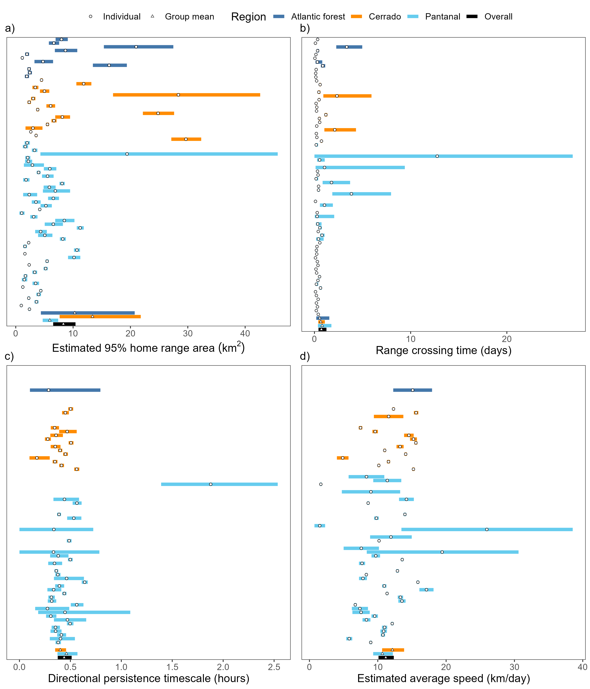

```{r setup, include=FALSE}
knitr::opts_chunk$set(echo = FALSE, eval = TRUE)
```

# Methods

<!-- More details on cleaning, criteria for removal, how many datapoints before and after -->

## Study area and data collection

The data was collected in three different ecosystems in southern Brazil (Fig. \@ref(fig:map)): south-western Cerrado (savannah, control environment), Pantanal (wetland, agricultural environment), and western Mata Atlântica (forest, degraded environment).

*Add details on climate and land use?*

Animals were tracked using VHF tracking (all three regions) and GPS tracking (Pantanal and Cerrado). *Add details on capturing and tracking devices*

A total of 74 tapirs were tracked starting in July of 1997 until October of 2019, with the majority of the data being in the Pantanal (46), while 17 and 11 were from the Cerrado and Mata Atlântica regions, respectively. 

```{r map, fig.cap='Location of the tree study sites (Pantanal, Cerrado, Mata Atlântica) over a raster of Human Footprint Index, which is a measure of anthropogenic alteration of an ecosystem.', fig.pos='h'}
knitr::include_graphics('../figures/map.png')
```

## Data analysis

All statistical analysis and plotting were performed using `R` [version 4.0.5, @r_core_team_r_2021] using packages `ctmm` [version 0.6.1, @fleming_ctmm_2021], `mgcv` [version 1.8-36, @wood_generalized_2017], `ggplot2` [version , @wickham_ggplot2_2016] `ggmap` [version , @kahle_ggmap_2013]. The `furrr` package [version 0.2.2, @vaughan_furrr_2021] was used for parallel computation on Windows machines. All `R` code can be found in the GitHub repository at https://github.com/StefanoMezzini/tapirs.

Before analysis, outliers were removed if they appeared to be unreliable due to large measurement errors after accounting for measurement uncertainty and following the methods detailed in the `ctmm` package [@fleming_ctmm_2021]. Location estimates from GPS tracking were calibrated using a unitless Horizontal Dilution of Precision (HDOP), which estimated the accuracy of each positional fix. We then estimated an equivalent range error with the HDOP values from 883 and 174 measurements from tags in fixed locations in the Pantanal and Cerrado, respectively [@fleming_comprehensive_2020]. Data points were then considered as outliers (and removed) if they had a large (error-informed) distance from the median location and the minimum speed required to explain the displacement was unusually high ($\ge 1$m/s). The Mata Atlântica dataset contained a total of 4 082 observations, 8 of which were removed as outliers; and the Pantanal dataset contained 139 138 observations, 914 of which were removed; while the Cerrado dataset contained 90 402 observations, 193 of which were removed. *(no speed outliers found when I (Stefano) was cleaning the datasets, but 1105 outliers had already been removed)*

The best Continuous-Time Movement Model (CTMM) for each animal was then chosen using the `ctmm.select` function from the `ctmm` package, which fits a series of CTMMs using perturbative Hybrid Residual Maximum Likelihood (pHREML, @fleming_overcoming_2019) and chooses the best model using small-sample-sized corrected Akaike’s Information
Criterion (AICc).

Using each of the best models, we then estimated each animal's home range (HR) area, range crossing time, directional persistence, and average daily speed. The models used here are insensitive to sampling frequency (@noonan_scale-insensitive_2019) and they account for spatio-temporal autocorrelation in the data (when possible), so they are robust to irregular or frequent sampling frequency, HR underestimation, and significance inflation.

The HR of each tapir was estimated as the area within the 95% isopleth of the Utilization Distribution using Autocorrelated Kernel Density Estimation (AKDE) obtained from the CTMM (@fleming_rigorous_2015).

<!-- small-sample-size bias correction of Fleming & Calabrese (2017)? -->

To test whether environmental modification significantly altered the animals' behavior, the HR sizes and average daily speeds were regressed against their HR's average human footprint index using Generalized Linear Models (GLMs) with a Gamma distribution and a log link for the response. The Gamma distribution allows for more accurate significance testing, while the log link scale allows HFI to have a multiplicative effect on the response. The GLMs were fit using the `mgcv` package [@wood_generalized_2017], and Restricted Maximum Likelihood (REML).

# Results


*change values to more appropriate estimates; currently using mean +/- 1.96 sd/sqrt(n)*

The mean home range size across all monitored tapirs was 5.82 km$^2$ (95% CI: 4.71 - 7.12 km$^2$), ranging between  1 km$^2$ and 29.7 km$^2$ (Fig. \@ref(fig:meta)a). Tapirs had HR crossing times of 0.72 days on average (95% CI: 0.35 - 1.10), ranging from 0.05 to 12.8 days (Fig. \@ref(fig:meta)b), and a mean velocity autocorrelation timescale of 0.44 hours (95% CI: 0.39 - 0.49), ranging from 0.17 to 1.88 hours (Fig. \@ref(fig:meta)c). We estimated that tapirs had mean movement speeds of 11.2 km/day (95% CI: 10.2 - 12.1), ranging from 1.51 to 25.96 km/day (Fig. \@ref(fig:meta)d).

```{r, eval = FALSE, echo = FALSE}
select(tap, name, speed.est, speed.high, speed.low, tau.position.est,
       tau.position.low, tau.position.high, tau.velocity.est, tau.velocity.low,
       tau.velocity.high, average) %>%
  filter(average)
range(tapirs$speed.est, na.rm = TRUE) # km/day
```

```{r meta, fig.cap='Parameter estimates from each tapir\'s movement model (circles) and group means (triangles), with 95% confidence intervals. Individuals with a movement model that does not allow for inferences in movement speed are left blank.', fig.pos='h'}

```

HFI had a negative effect on both HR size and average daily speed, but the effect was not significant for HR (p-value = 0.90), nor daily speed (p-value = 0.53). A tapir living in a pristine environment (HFI = 0.004) was estimated to have a home range of 7.79 km$^2$ and an average speed of 13.19 km/day, while a tapir from the most altered habitat (HFI = 0.31) had an estimated home range area of 6.93 km$^2$ and an average speed of 10.43 km/day.

```{r, eval = FALSE, echo = FALSE}
min(tapirs$hfi.mean)
max(tapirs$hfi.mean)
# see hfi-regressions.R
# hr size
predict(m0, newdata = tibble(hfi.mean = c(0.004, 0.305)), type = 'response') %>%
  round(2)
summary(m0)
# speed
predict(m3, newdata = tibble(hfi.mean = c(0.004, 0.305)), type = 'response') %>%
  round(2)
summary(m3)
```

# References
